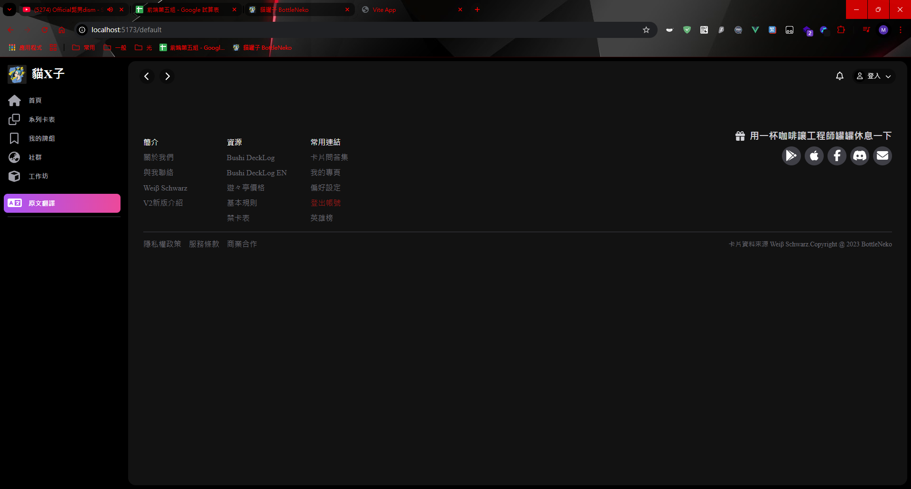

# Note

## src > views
### WorkShopView.vue
工作坊頁面切版

### DefaultUi.vue
把頂部欄、側邊欄、內容區塊整合的複用版面
<!--  -->

## src > components
### PageControl.vue
頂部欄

### SideBar.vue
側邊欄

### MainFooter.vue
頁底欄

## src > assets > css
### reset.css
重置預設樣式的CSS

### workshop-rwd.css
工作坊RWD的CSS

### page-control-rwd.css
上下頁切換、通知跟登入按鈕欄RWD的CSS

### sidebar-rwd.css
側邊欄RWD的CSS

### main-footer-rwd.css
頁底欄RWD的CSS

